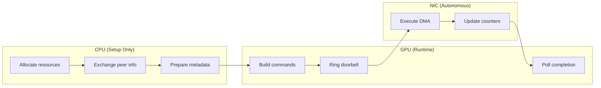
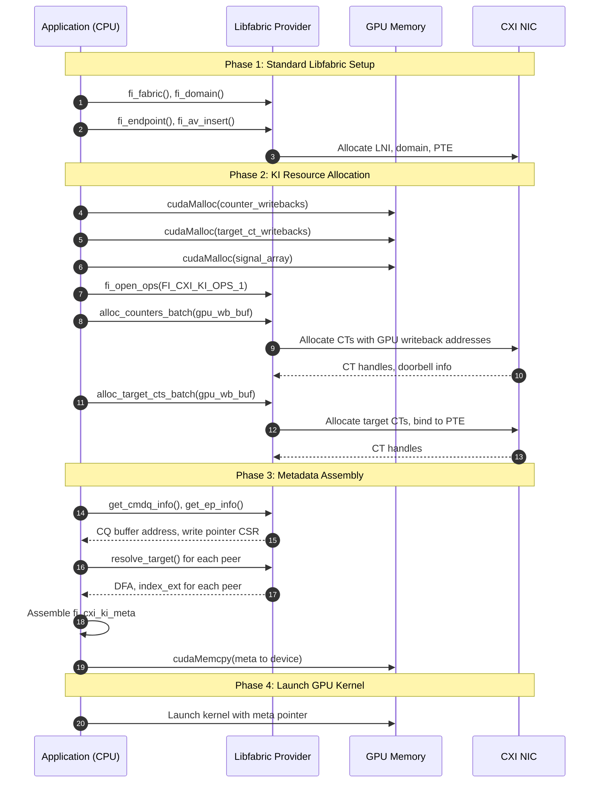
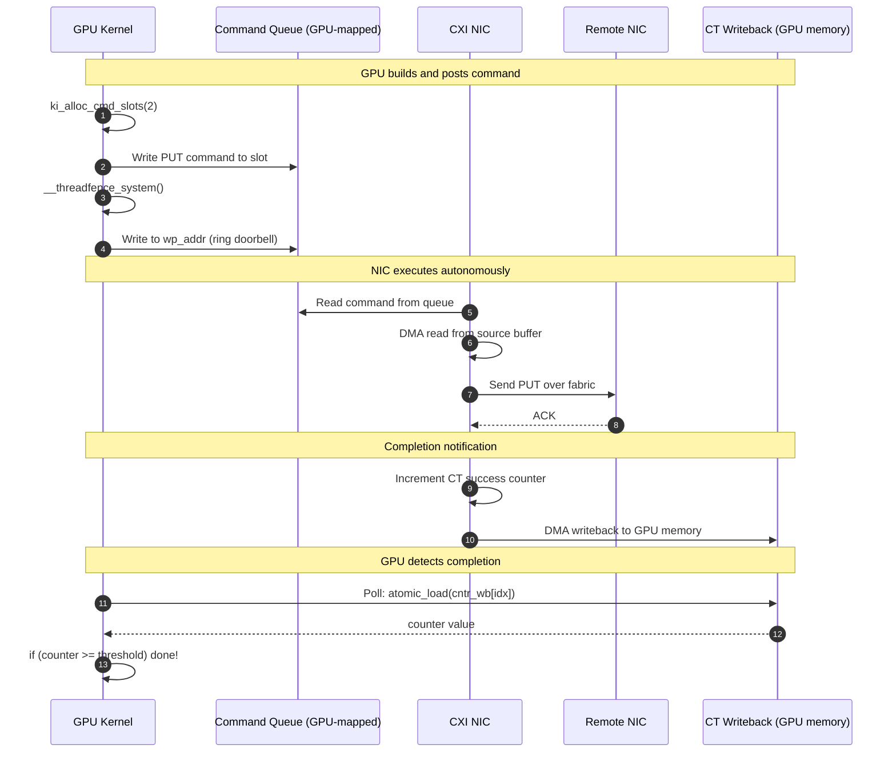
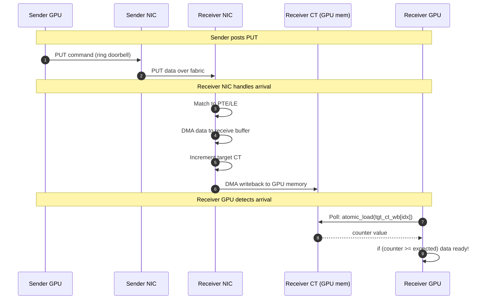
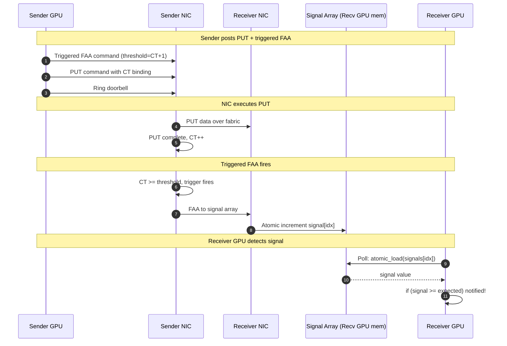
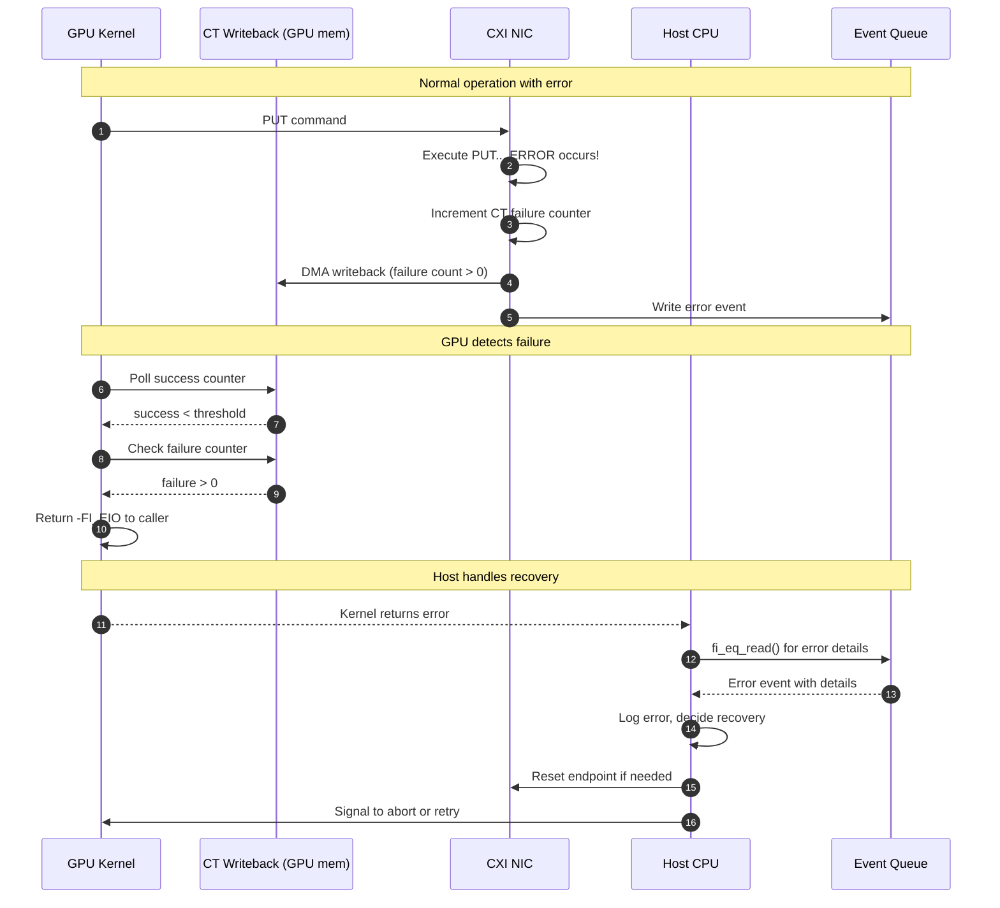
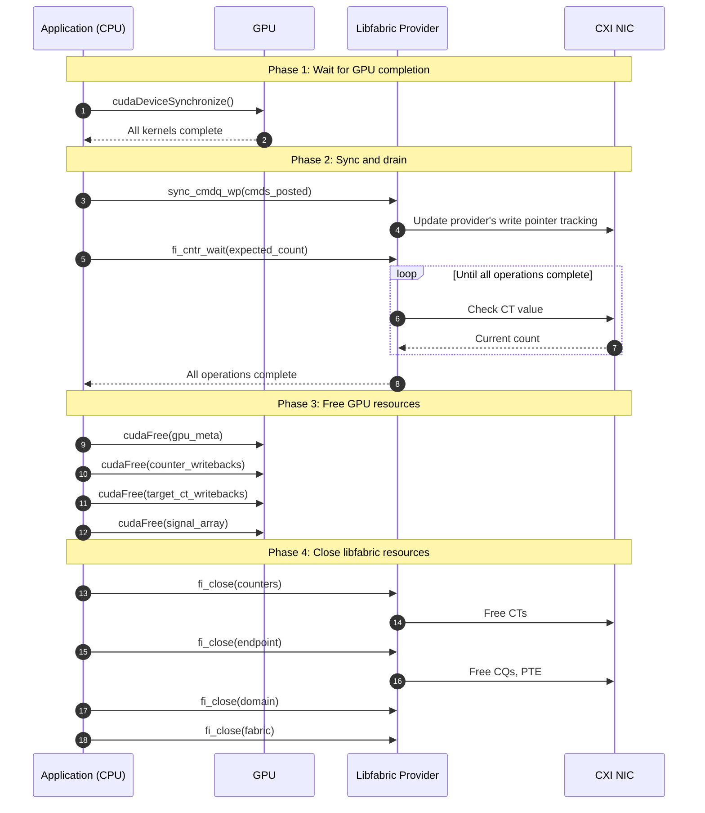

# Libfabric CXI Provider - Kernel Initiated (KI) API v4

## Definitions and Acronyms

| Term | Definition |
|------|------------|
| **KI** | Kernel Initiated - GPU kernels directly post network operations |
| **CXI** | Cray/HPE Cassini eXtended Interface - the NIC architecture |
| **CT** | Counting Event (or Counter) - hardware counter that tracks operation completions |
| **CQ** | Command Queue - ring buffer where commands are posted for NIC execution |
| **PTE** | Portal Table Entry - receive-side endpoint configuration |
| **LE** | List Entry - buffer descriptor appended to a PTE for receiving data |
| **DFA** | Destination Fabric Address - NIC routing address for a remote endpoint |
| **MR** | Memory Region - registered memory accessible by the NIC |
| **IOVA** | IO Virtual Address - NIC-visible address for registered memory |
| **LAC** | Logical Address Context - memory protection domain identifier |
| **VNI** | Virtual Network ID - network isolation/partitioning identifier |
| **NID** | Node ID - unique identifier for a node in the fabric |
| **PID** | Process ID - endpoint identifier within a node |
| **FAA** | Fetch-and-Add - atomic operation used for signaling |
| **MMIO** | Memory-Mapped I/O - direct register access via memory mapping |
| **SoA** | Structure of Arrays - memory layout for GPU coalescing |
| **AoS** | Array of Structures - traditional memory layout (less GPU-friendly) |
| **CTA** | Cooperative Thread Array - CUDA/HIP term for a thread block |
| **MoE** | Mixture of Experts - ML architecture with dynamic expert routing |

---

## Overview

The Kernel Initiated (KI) extensions enable GPU kernels to directly post RDMA operations to the CXI NIC without CPU involvement during data transfer. This API supports GPU-initiated networking for distributed ML workloads including MoE (Mixture of Experts) token dispatch.



---

## Implementation Summary

### What Needs to Be Built

| Layer | New Code Required | Dependencies |
|-------|-------------------|--------------|
| **GPU** | `fi_cxi_ki_gpu.h` header-only library | Metadata from libfabric |
| **Libfabric** | `fi_cxi_ki_ops` extension, metadata assembly | Existing libcxi structures |
| **libcxi** | None | — |
| **Driver** | None | — |

### Layer-by-Layer Requirements

**1. GPU Header (`fi_cxi_ki_gpu.h`) — NEW**

A header-only library that GPU kernels include. Provides device functions to:
- Build and emit CXI commands to mmap'd command queues
- Ring doorbells via mmap'd CSRs
- Poll writeback buffers in GPU memory

This is entirely new code. See [GPU API](fi_cxi_ki_gpu.md).

**2. Libfabric Provider — NEW**

New `fi_cxi_ki_ops` extension structure:
```c
struct fi_cxi_ki_ops {
    int (*get_cmdq_info)(...);    // Accesses existing struct cxi_cq fields
    int (*get_ep_info)(...);      // Uses existing provider data
    int (*resolve_target)(...);   // Uses existing AV lookup
    int (*get_mr_info)(...);      // Uses existing MR data
    int (*sync_cmdq_wp)(...);     // Post-kernel write pointer sync
};
```

New `fi_cxi_ki_meta` structure assembly to package all KI resources for GPU access.

The provider accesses existing public libcxi/CXI structures directly:
- `struct cxi_cq`: `cmds`, `size`, `wp_addr` fields
- `struct cxi_ct`: `doorbell` field
- Existing `fi_cxi_cntr_ops` for counter access

See [Libfabric API](fi_cxi_ki_libfabric.md).

**3. libcxi — NO CHANGES**

The relevant structures are already public in `cxi_prov_hw.h`:
- `struct cxi_cq` — command buffer, write pointer CSR
- `struct cxi_ct` — doorbell address

The provider already accesses these directly (e.g., `cntr->ct->doorbell` in existing counter ops).

See [libcxi API](fi_cxi_ki_libcxi.md) for reference.

**4. CXI Kernel Driver — NO CHANGES**

The existing driver already provides all required functionality:
- CT allocation with writeback buffer (`CXI_OP_CT_ALLOC`)
- CT writeback update for GPU memory (`CXI_OP_CT_WB_UPDATE`)
- CQ allocation with mmap'd command buffer and write pointer
- GPU memory registration via dmabuf (`CXI_OP_ATU_MAP` with hints)

See [CXI Driver](fi_cxi_ki_driver.md) for reference documentation on existing interfaces.

---

## Document Structure

| Document | Content |
|----------|---------|
| [GPU API](fi_cxi_ki_gpu.md) | **NEW**: Header-only GPU library specification |
| [Libfabric API](fi_cxi_ki_libfabric.md) | **NEW**: `fi_cxi_ki_ops` extension + metadata structure |
| [libcxi API](fi_cxi_ki_libcxi.md) | **REFERENCE**: Existing structures/APIs used by KI |
| [CXI Driver](fi_cxi_ki_driver.md) | **REFERENCE**: Existing driver interfaces used by KI |

```
┌─────────────────────────────────────────────────────────────────────────────┐
│  Application / NCCL GIN Plugin                                              │
│  - Calls fi_cxi_ki_* host APIs to set up resources                          │
│  - Launches GPU kernels with fi_ki_meta_t                                   │
└─────────────────────────────────────────────────────────────────────────────┘
                                    │
              ┌─────────────────────┴─────────────────────┐
              │                                           │
              ▼                                           ▼
┌─────────────────────────────┐             ┌─────────────────────────────────┐
│  GPU Kernels                │             │  Libfabric CXI Provider         │
│  #include fi_cxi_ki_gpu.h   │             │  NEW: fi_cxi_ki_ops extension   │
│  NEW: fi_cxi_inject_put_*() │             │  NEW: fi_cxi_ki_meta assembly   │
│  NEW: fi_cxi_ring_doorbell()│             │  Uses: fi_cxi_cntr_ops (exists) │
│  See: fi_cxi_ki_gpu.md      │             │  See: fi_cxi_ki_libfabric.md    │
└─────────────────────────────┘             └─────────────────────────────────┘
                                                          │
                                                          ▼
                                            ┌─────────────────────────────────┐
                                            │  libcxi (userspace library)     │
                                            │  NO CHANGES REQUIRED            │
                                            │  Public: struct cxi_cq, cxi_ct  │
                                            │  See: fi_cxi_ki_libcxi.md       │
                                            └─────────────────────────────────┘
                                                          │
                                                          ▼
                                            ┌─────────────────────────────────┐
                                            │  CXI Kernel Driver              │
                                            │  NO CHANGES REQUIRED            │
                                            │  Existing: CT/CQ alloc, dmabuf  │
                                            │  See: fi_cxi_ki_driver.md       │
                                            └─────────────────────────────────┘
                                                          │
                                                          ▼
                                            ┌─────────────────────────────────┐
                                            │  CXI NIC Hardware (Cassini)     │
                                            │  Command queues, CTs, DMA       │
                                            └─────────────────────────────────┘
```

---

## Detailed Flows

### Setup Flow



### Runtime Flow (PUT with Completion)



### Model A: Target-Side CT (Receiver Completion)



### Model B: Initiator Signal (Sender-Triggered Notification)



### Error Handling Flow



### Teardown Flow



---

## Completion Models

KI v4 supports two completion notification models:

### Model A: Target-Side CT (Recommended for MoE)

The receiver's NIC tracks incoming PUTs via counting events (CTs) with GPU-accessible writeback. No additional network traffic beyond the PUT itself.

```
Sender                                    Receiver
──────                                    ────────
PUT data ─────────────────────────────────► memory
                                               │
                                          target CT++
                                               │
                                          writeback to GPU
                                               │
                                          GPU polls CT
```

**Advantages**: Lower latency, simpler sender logic, no extra network ops

**Use when**: Receiver needs to know "data arrived" (MoE token collection)

### Model B: Initiator-Triggered Signals

The sender triggers a remote atomic (FAA) to increment the receiver's signal memory upon PUT completion.

```
Sender                                    Receiver
──────                                    ────────
PUT data ─────────────────────────────────► memory
    │
local CT++
    │
triggered FAA ────────────────────────────► signal[i]++
                                               │
                                          GPU polls signal
```

**Advantages**: Sender controls notification timing, can signal specific events

**Use when**: Sender needs to notify receiver of specific operations, or for barriers

### Choosing a Model

| Scenario | Recommended Model |
|----------|-------------------|
| MoE token dispatch | Target CT (aggregate) |
| MoE with per-peer tracking | Target CT (per-peer via match bits) |
| Point-to-point notification | Initiator signals |
| Barriers / synchronization | Initiator signals |
| Pipelined sends with flow control | Initiator signals |

Both models can be used simultaneously in the same application.

---

## Core Concepts

**Contexts**: Independent command queues for parallel operation posting.

**Counters**: Track local send completion (source buffer reusable).

**Signals**: Remote memory incremented by sender-initiated atomics (Model B).

**Target CTs**: Local counters incremented by incoming PUTs (Model A).

**Match Bits**: Optional tags on PUTs to route to specific target CTs.

---

## Resource Limits

### Hardware Limits (Per-Device)

From the CXI driver (see [CXI Driver - Resource Limits](fi_cxi_ki_driver.md#resource-limits)):

| Resource | Max Count | Constant |
|----------|-----------|----------|
| Counting Events (CTs) | 2048 | `C_NUM_CTS` |
| TX Command Queues | 1024 | `C_NUM_TRANSMIT_CQS` |
| Target Command Queues | 512 | `C_NUM_TARGET_CQS` |
| Portal Table Entries | 2048 | `C_NUM_PTLTES` |
| CQ Entries (per queue) | 65536 | `CXI_MAX_CQ_COUNT` |

### Software Design Choices

The `fi_cxi_ki_meta` structure uses fixed array sizes for simplicity:

| Resource | Default | Notes |
|----------|---------|-------|
| Command contexts | 8 | `FI_KI_MAX_CONTEXTS` in metadata |

Actual limits for counters, signals, and target CTs depend on how many hardware CTs the application allocates and how they're partitioned between use cases.

---

## NCCL GIN Compatibility

### API Mapping

| NCCL GIN Concept | KI v4 Mapping |
|------------------|---------------|
| `gin.put()` | `fi_cxi_inject_put` (with signal) or `fi_cxi_inject_put_simple` |
| `gin.put(..., ncclGin_SignalInc{idx})` | `fi_cxi_inject_put(..., remote_signal_idx, 1, ...)` |
| `gin.flush()` | `fi_cxi_flush` |
| `gin.readSignal()` | `fi_cxi_signal_read` or `fi_cxi_target_ct_read` |
| `gin.waitSignal()` | `fi_cxi_signal_wait` or `fi_cxi_target_ct_wait` |
| `ncclGinBarrierSession` | Build on `fi_cxi_signal_send` / `fi_cxi_signal_wait` (see examples) |
| GIN context | `context_index` parameter |
| `ncclCoopCta` / `ncclCoopWarp` | `fi_ki_coop_t` (BLOCK, WARP, THREAD) |

### Feature Comparison

| Feature | NCCL GIN | KI v4 | Notes |
|---------|----------|-------|-------|
| One-sided PUT | ✓ | ✓ | |
| Remote signal on PUT | ✓ | ✓ | Model B |
| Target-side CT | — | ✓ | Model A (KI-specific) |
| Flush | ✓ | ✓ | |
| Signal read/wait/reset | ✓ | ✓ | |
| Multiple contexts | ✓ | ✓ | |
| Cooperative groups | ✓ | ✓ | |
| Barrier primitive | ✓ (built-in) | Build from signals | See tree barrier example |
| Team abstraction | ✓ (World/Rail) | Peer indices | Use AV on host |
| GET operation | — | — | Neither supports device GET |

### Not Applicable to KI

These NCCL features are NVLink-specific and don't apply to CXI network fabric:

- **LSA (Load/Store Accessible)**: Direct GPU memory access over NVLink
- **Multimem**: NVLink SHARP hardware multicast/reduction
